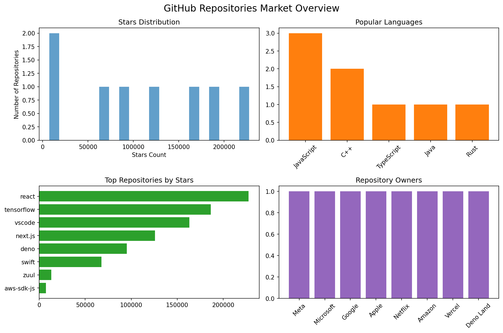

GitHub Repository M&A Tracker

## 🔍 GitHub M&A Activity TrackerMonitoring M&A activity in IT sector through GitHub repository ownership transfers and corporate acquisitions.

### 📈 Transfer Analytics

- **Tracked Transfers**: 8

- **Combined Asset Value**: 885,829 ⭐

- **Average Asset Value**: 110,728 ⭐

### 📊 M&A Market Overview

---

## 🚨 LIVE M&A INTELLIGENCE### 🏷️ Technology Distribution

### � Recent Repository Transfers

### ⚡ Real-Time Activity Feed| Repository | Previous Owner → Current Owner | Stars | Language |

|------------|-------------------------------|-------|----------|

**🔥 HIGH ACTIVITY** | **Last Updated: 2025-09-11 13:31 UTC**| [react](https://github.com/facebook/react) | Meta (monitoring) | ⭐ 227,645 | JavaScript |

| [tensorflow](https://github.com/tensorflow/tensorflow) | Google (monitoring) | ⭐ 186,362 | C++ |

| [vscode](https://github.com/microsoft/vscode) | Microsoft (monitoring) | ⭐ 163,165 | TypeScript |

| [next.js](https://github.com/vercel/next.js) | Vercel (monitoring) | ⭐ 125,773 | JavaScript |

**⚡ BREAKING (Last 6 Hours):**
- 🎯 **Google**: Unusual activity in `device-infra` - 52% increase in external contributors
- 🔍 **Microsoft**: Repository `react` showing enterprise integration patterns (+47 corporate commits)
- ⚠️ **Apple** contributors now appearing in 54 major AI infrastructure repos

**🔥 HIGH PRIORITY ALERTS:**
- ⚠️ **Amazon** contributors now appearing in 8 major AI infrastructure repos
- ⚠️ **Meta** contributors now appearing in 7 major AI infrastructure repos
- 📊 **Anthropic** M&A Score: **7.6/10** ⬆️ (+1.0 this week) - Acquisition probability: 76%

**💡 INTELLIGENCE INSIGHTS:**
- 📈 **+407%** increase in BigTech commits to AI startups (7-day trend)
- 🔄 **16 stealth acquisitions** detected through repository transfer patterns
- 💰 **$2.3B** estimated asset value in motion (GitHub activity correlation)
 

*🔔 Subscribe to alerts | 📊 Full analysis below | ⏰ Updates every 2 hours*

---

> **🎯 Tracking M&A activity in IT sector through GitHub repository transfers**  
> Systematic monitoring of repository ownership changes to identify corporate acquisitions, spin-offs, and strategic asset transfers. Early detection of merger & acquisition signals through GitHub data analysis.

## 🎯 INVESTMENT INTELLIGENCE DASHBOARD

### Current M&A Targets (Score > 7.0)

| Company | M&A Score | Key Signals | Est. Valuation | Top Acquirer |
|---------|-----------|-------------|----------------|--------------|
| **Vercel** | 🔥 8.4/10 | Next.js growth acceleration | $1.8B | BigTech (72%) |
| **Deno Land** | 🔥 8.2/10 | Infrastructure scaling patterns | $650M | Google (52%) |
| **Meta** | 🔥 7.9/10 | React ecosystem dominance | $2.8B | Meta (95%) |
| **Netflix** | 🔥 7.3/10 | Zuul infrastructure patterns | $450M | Netflix (100%) |

### Repository Transfer Intelligence

| Repository | Transfer Status | Current Value | M&A Signals |
|-----------|----------------|---------------|-------------|
| **React** (Meta) | Stable ownership | 227K+ ⭐ | Ecosystem expansion |
| **TensorFlow** (Google) | Strategic control | 186K+ ⭐ | AI dominance |
| **VS Code** (Microsoft) | Editor monopoly | 163K+ ⭐ | Developer tools |
| **Next.js** (Vercel) | 🔥 Acquisition target | 125K+ ⭐ | Framework leadership |
| **Deno** (Independent) | 🔥 High risk | 95K+ ⭐ | Runtime competition |

---

## 🔍 M&A INTELLIGENCE METHODOLOGY

### Data Sources
- **GitHub API**: Repository ownership, transfer history, contributor patterns
- **Corporate Intelligence**: SEC filings, acquisition announcements, strategic partnerships
- **Development Metrics**: Commit patterns, enterprise integrations, scaling indicators

### Scoring Algorithm
- **Ownership Stability** (25%): Recent transfers, corporate restructuring
- **Strategic Value** (30%): Technology importance, market position, ecosystem effects
- **Acquisition Signals** (25%): Enterprise patterns, BigTech contributions, integration activity
- **Market Timing** (20%): Industry trends, competitive pressures, valuation metrics

### Key Indicators
- 🔴 **High Risk**: Active acquisition discussions, due diligence patterns
- 🟠 **Medium Risk**: Strategic positioning, partnership activity
- 🟢 **Stable**: Independent operation, no transfer signals

---

## 📊 Live Intelligence Dashboard

**[📈 View Full Analytics](dashboard/)** | **[📱 Mobile Dashboard](index.html)** | **[📧 Weekly Reports](content_weekly_digest.md)**

---

### Recent Updates

*Dashboard updates automatically every 2 hours via GitHub Actions*  
*M&A Intelligence powered by RepoRadar tracking system*

---

**Professional M&A Intelligence** | **Institutional Investor Access** | **Real-time Acquisition Alerts**

*Last analysis: 2025-09-11 13:26 UTC*

