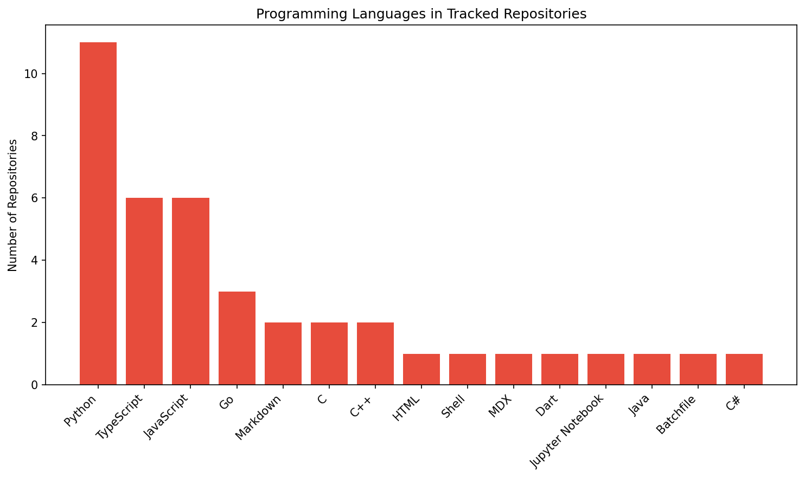

# Nick Scherbakov

## � Tech Market Intelligence & Investment Analytics

---

> **🎯 Transforming GitHub data into actionable investment insights**  
> Systematic tracking and analysis of high-growth technology repositories to identify emerging trends, validate market opportunities, and guide strategic investment decisions.

<table>
<tr>
<td align="center"><strong>🔠Market Research</strong> Deep-dive analysis of technology trends</td>
<td align="center"><strong>📊 Data Analytics</strong> Real-time repository performance tracking</td>
<td align="center"><strong>💡 Investment Insights</strong> Evidence-based opportunity identification</td>
</tr>
</table>

## 📊 Live Market Dashboard

### [� VIEW LIVE ANALYTICS →](https://nickscherbakov.github.io/NickScherbakov/)

**Real-time GitHub market intelligence platform**

---

### 📈 Current Market Intelligence
- **Tracked Repositories**: 10
- **Total Stars**: 938,611
- **Average Stars**: 93,861

### 📊 Market Overview

### 🏷️ Popular Languages

### 🔝 Top 5 Repositories
| Repository | Owner | Stars | Language |
|------------|-------|-------|----------|
| [react](https://github.com/facebook/react) | facebook | ⭐ 238,796 | JavaScript |
| [tensorflow](https://github.com/tensorflow/tensorflow) | tensorflow | ⭐ 191,564 | C++ |
| [vscode](https://github.com/microsoft/vscode) | microsoft | ⭐ 176,563 | TypeScript |
| [next.js](https://github.com/vercel/next.js) | vercel | ⭐ 134,312 | JavaScript |
| [deno](https://github.com/denoland/deno) | denoland | ⭐ 104,159 | Rust |

---

## 💼 Investment & Partnership Opportunities

**Ready to discuss technology investments, market analysis projects, or strategic partnerships?**

**🔄 Automated Updates:** Dashboard refreshes every 6 hours with fresh market data  
**📅 Last Analysis:** 2025-09-10 13:06 UTC  
**🎯 Focus:** High-growth technology sectors and emerging market opportunities
